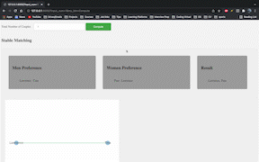

# Stable Matching Problem

This project aims to visualize a very famous stable matching algorithm.

Definition: The stable matching problem is the problem of finding a stable matching between two equally sized sets of elements given an ordering of preferences for each element

The HTML page designed displays the bipartite graph of the result of the stable matching algorithm.

1. The user can specify the number of couples using which the result is generated.
2. The preferences are set each time randomly

<!--  -->
